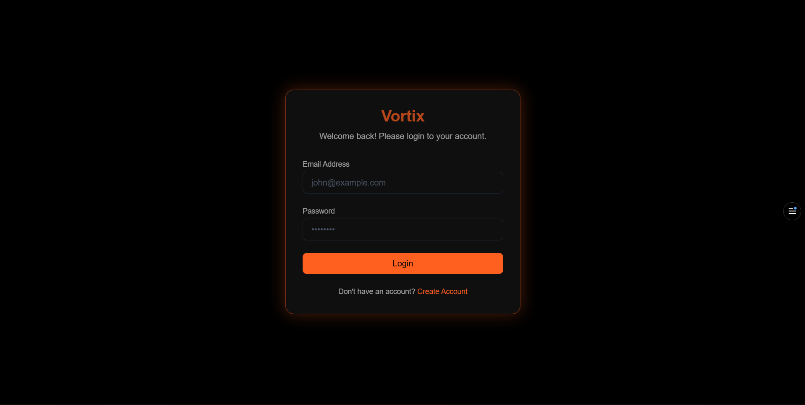
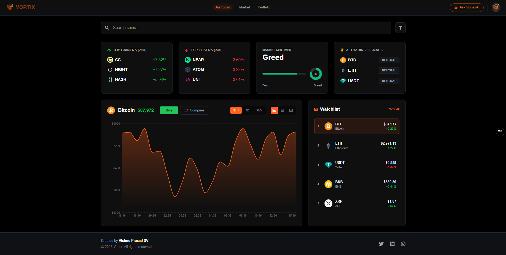
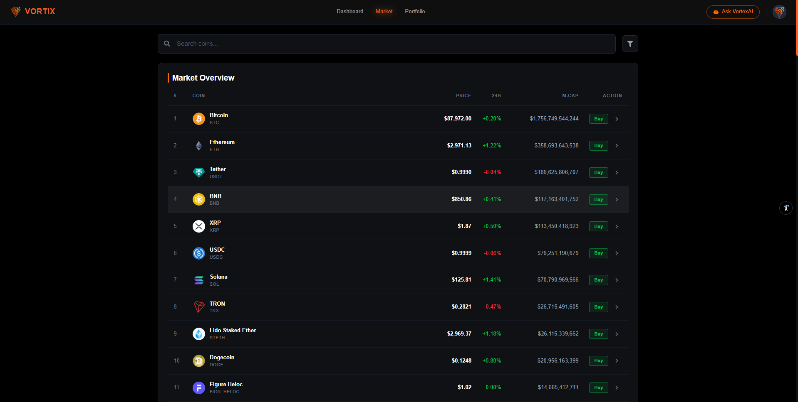
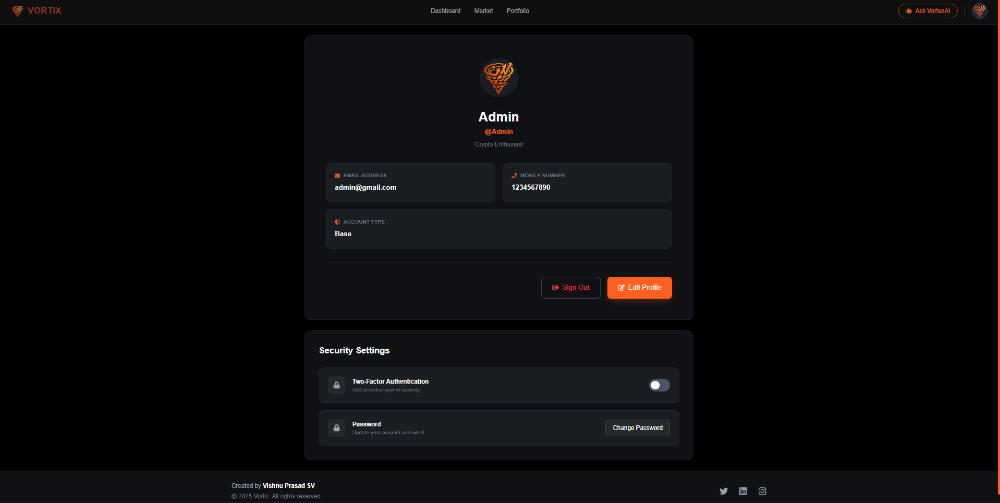

# Vortix - Cryptocurrency Trading Platform

## 🔗 Live Demo
[ https://vortix-ecru.vercel.app/ ]

## 📖 Description
Vortix is a modern, feature-rich cryptocurrency trading platform that provides real-time market data, portfolio management, and AI-powered trading insights. Built with React and powered by Google's Gemini AI, Vortix offers an intuitive interface for both novice and experienced crypto traders to track, analyze, and manage their digital assets with ease.

## ✨ Features
- **Real-Time Market Data**: Live cryptocurrency prices, 24h changes, and market trends
- **Interactive Charts**: Advanced charting with comparison tools and multiple timeframes
- **Portfolio Management**: Track your holdings, buy/sell assets, and monitor performance
- **AI-Powered Assistant**: VortixAI chatbot for cryptocurrency insights and market analysis
- **User Authentication**: Secure login/signup with Supabase integration
- **Profile Management**: Customizable user profiles with image upload and password management
- **Two-Factor Authentication**: Enhanced security with 2FA support
- **Market Analytics**: Top gainers, losers, market sentiment, and trading signals
- **Funds Management**: Deposit and withdraw funds seamlessly
- **Responsive design for all devices**: Optimized for mobile, tablet, and desktop

## 🎯 Project Goals
This project was developed to demonstrate proficiency in building modern web applications with real-world functionality. The main objectives were to:
- Master React.js and state management with Redux Toolkit
- Integrate third-party APIs and AI services (Google Gemini AI)
- Implement secure authentication and database management with Supabase
- Create a responsive, visually appealing UI with Tailwind CSS
- Build reusable components and maintain clean code architecture
- Implement real-time data visualization with interactive charts
- Develop a complete full-stack application from concept to deployment

## 🛠️ Technologies Used
- **Frontend:** React.js (v19.2.0)
- **Styling:** Tailwind CSS v4, CSS3, Framer Motion for animations
- **State Management:** Redux Toolkit
- **Routing:** React Router DOM v7
- **Backend/Auth:** Supabase (Authentication & Database)
- **APIs:** Google Generative AI (Gemini), Cryptocurrency market data
- **Charts:** Recharts for data visualization
- **Icons:** React Icons, Lucide React
- **HTTP Client:** Axios
- **Build Tool:** Vite
- **Utilities:** clsx, tailwind-merge
- **Deployment:** Vercel

## 🤖 AI Integration
Vortix features an intelligent AI assistant powered by Google's Gemini AI:
- **VortixAI Chatbot**: Provides real-time cryptocurrency insights, market analysis, and trading recommendations
- **Context-Aware Responses**: Trained on cryptocurrency-specific data to deliver accurate and relevant information
- **Interactive UI**: Beautiful orange neon-themed chat interface with pre-set questions for quick access
- **Integration Challenges**: Successfully integrated Gemini AI API with proper error handling and rate limiting
- **User Experience**: Accessible via a floating button on Dashboard and Market pages for instant assistance

## 🚀 Setup Instructions

### Prerequisites
- Node.js (v14 or higher)
- npm or yarn
- A Supabase account (for authentication and database)
- Google Gemini API key (for AI features)

### Installation Steps

1. **Clone the repository**
```bash
git clone https://github.com/Vishnuprasadsv/Vortix.git
```

2. **Navigate to project directory**
```bash
cd vortix
```

3. **Install dependencies**
```bash
npm install
```

4. **Create .env file**
Create a `.env` file in the root directory and add your API keys:
```env
VITE_SUPABASE_URL= added in vercel enviornment variables due to security reasons
VITE_SUPABASE_ANON_KEY= added in vercel enviornment variables due to security reasons
VITE_GEMINI_API_KEY= added in vercel enviornment variables due to security reasons
```

5. **Set up Supabase Database**
- Create a new Supabase project
- Run the SQL scripts in the following order:
  - `setup_database.sql` - Creates user profiles table
  - `setup_storage.sql` - Sets up storage for profile images
  - `setup_trigger.sql` - Creates automatic profile creation trigger
  - `fix_storage_policies.sql` - Configures storage policies
  - `fix_rls_policy.sql` - Sets up row-level security

6. **Start development server**
```bash
npm run dev
```

7. **Open in browser**
Navigate to `http://localhost:5173` in your browser

## 📱 Responsive Design
This application is fully responsive and tested on:
- Mobile devices (375px and up)
- Tablets (768px and up)
- Desktop (1024px and up)

All components adapt seamlessly across different screen sizes, with optimized layouts for mobile navigation, chart displays, and data tables.

## 📸 Screenshots
### Dashboard & Market








## 🎨 Design Choices
- **Color Scheme**: Modern dark theme with neon orange accents for a futuristic crypto trading aesthetic
- **Typography**: Clean, professional fonts for optimal readability
- **Animations**: Subtle micro-interactions using Framer Motion to enhance user engagement
- **Component Architecture**: Modular, reusable components following React best practices
- **State Management**: Centralized Redux store for predictable state updates across the application
- **User Experience**: Intuitive navigation with sticky headers, loading states, and informative error messages

## 🐛 Known Issues
- None at the moment. All major features are fully functional.

## 🔮 Future Enhancements
- **Real-Time WebSocket Integration**: Live price updates without page refresh
- **Advanced Trading Features**: Limit orders, stop-loss, and automated trading strategies
- **Price Alerts**: Customizable notifications for price movements
- **Historical Data Analysis**: Extended chart data with technical indicators (RSI, MACD, etc.)
- **Multi-Currency Support**: Support for fiat currency conversions
- **Social Features**: Community discussions and shared trading strategies
- **Mobile App**: Native iOS and Android applications
- **Enhanced AI Features**: Predictive analytics and personalized trading recommendations

## 👤 Author
Vishnu Prasad 
- **GitHub**: [@Vishnuprasadsv]( https://github.com/Vishnuprasadsv )
- **LinkedIn**: [Your Profile]( www.linkedin.com/in/vishnu-prasad-sv )
- **Email**: vishnusvprasad@gmail.com

## 📄 License
This project is open source and available under the name VishnuPrasad.

## 🙏 Acknowledgments
- Thanks to **Entri** for the learning opportunity and project guidance
- Special thanks to my mentor, **Ajmal**, for the learning opportunity and project guidance.
- **Google Gemini AI** for providing the AI capabilities
- **Supabase** for authentication and database services
- **CoinGecko/CryptoCompare** for cryptocurrency market data
- **React Icons** and **Lucide React** for beautiful iconography
- **Recharts** library for powerful chart visualizations
- **Tailwind CSS** team for the amazing utility-first CSS framework
- **Vercel** for seamless deployment and hosting
